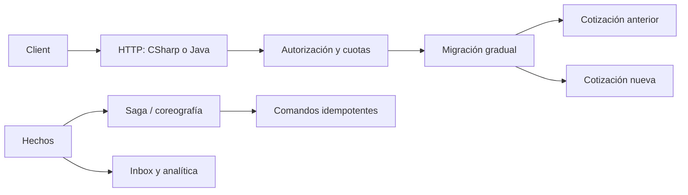

# Payment Architecture Platform

[](https://github.com/jorgefprietol/payment-architecture-platform/actions/workflows/ci.yml)

Proyecto de ingeniería para demostrar diseño de sistemas de pagos, migración incremental, coordinación distribuida, resiliencia y entrega automatizada. Incluye implementaciones equivalentes en **C# / .NET 10** y **Java 21**, servicios HTTP contenedorizados y despliegue en una laptop Windows con Docker Desktop.

## Arquitectura

El servicio cotiza comisiones mediante un puerto común y distribuye solicitudes entre implementaciones anterior y nueva. El núcleo incorpora una saga de reserva y liquidación, una alternativa por coreografía y una proyección analítica idempotente. Sus políticas de resiliencia y seguridad tienen escenarios explícitos de fallo y recuperación.



Las dos implementaciones son alternativas del mismo contrato. La API expone cotizaciones y sagas persistentes: el checkpoint guarda estado, inbox y comandos pendientes de forma atómica; un dispatcher recupera el outbox al reiniciar. Los volúmenes conservan estado y recibos idempotentes entre recreaciones del contenedor. La proyección analítica permanece en memoria. Los participantes locales registran efectos demostrables; no se conectan a una liquidación bancaria real.

## Ejecutar con Docker

Requisitos: Docker con contenedores Linux, Docker Compose y PowerShell 7.

```powershell
git clone https://github.com/jorgefprietol/payment-architecture-platform.git
cd payment-architecture-platform
$token = [Convert]::ToHexString([Security.Cryptography.RandomNumberGenerator]::GetBytes(32))
"API_TOKEN=$token" | Set-Content .env
docker compose up -d --build --wait
$env:API_TOKEN = $token
./scripts/smoke.ps1
```

| Servicio | Dirección local |
| --- | --- |
| C# | http://127.0.0.1:18080 |
| Java | http://127.0.0.1:18081 |

Los puertos se publican únicamente en loopback. Ambos contenedores ejecutan un usuario sin privilegios, filesystem de sólo lectura, `/tmp` temporal, capabilities eliminadas y límites de memoria, CPU y procesos.

```powershell
$headers = @{ Authorization = "Bearer $token" }
Invoke-RestMethod 'http://127.0.0.1:18080/quotes?id=11111111-1111-1111-1111-111111111111&amountMinor=1000&currency=USD' -Headers $headers
```

Los endpoints `/health/live`, `/health/ready` y `/metrics` permiten verificar operación. `/quotes` exige una credencial aleatoria de al menos 32 caracteres y admite `X-Correlation-ID`. `.env` no se incorpora a Git ni a las imágenes.

## Saga persistente por HTTP

```powershell
$id = [Guid]::NewGuid(); $eventId = [Guid]::NewGuid()
Invoke-RestMethod "http://127.0.0.1:18080/sagas/$id/events?eventId=$eventId&fact=Start" -Method Post -Headers $headers
Invoke-RestMethod "http://127.0.0.1:18080/sagas/$id" -Headers $headers
```

El dispatcher confirma el comando `reserve`; después se reciben `Reserved`, `Approved` y `Settled` con un `eventId` distinto por hecho. La ruta alternativa `Rejected` → `Released` compensa la reserva. Repetir el mismo evento conserva estado y efectos; cambiar su contenido devuelve 409. [Contrato, persistencia y recuperación](docs/durable-sagas.md).

## Verificación

El runner ejecuta **47 escenarios de aceptación por lenguaje**, comprueba la reanudación de snapshots y compara una huella de enrutamiento para 200 identificadores. El pipeline ejecuta además los escenarios dentro de las imágenes y smoke tests HTTP que verifican autenticación, validación, métricas y paridad.

La verificación nativa termina y reinicia procesos reales antes de enviar y después del efecto pero antes de confirmarlo. Comprueba replay, compensación, recuperación automática y checkpoints intercambiables entre C# y Java. CI también reinicia los contenedores con sus volúmenes y verifica la saga por HTTP.

```powershell
./verify.ps1
```

La verificación nativa requiere SDK .NET compatible con `global.json` y JDK 21. Los informes se guardan en `artifacts/`. Para ejecutar el flujo integrado:

```powershell
dotnet run --project csharp/PaymentPlatform.csproj -c Release -- --demo
```

## CI/CD y operación

Cada PR ejecuta CI en runners hospedados de Windows y Linux. Los contenedores se construyen con imágenes base fijadas por digest, se prueban y se escanean. Los hallazgos HIGH/CRITICAL con corrección disponible bloquean la publicación; se conservan informes de vulnerabilidades y SBOM SPDX.

Una ejecución correcta de `main` publica imágenes identificadas por el SHA del commit en GHCR y un bundle de entrega con checksum y atestación de procedencia. El controlador privado de despliegue detecta las entregas aprobadas y las promueve a esta laptop sin recompilar. Verifica procedencia, imagen, readiness y contratos HTTP; conserva la entrega anterior para rollback.

El runner de la laptop pertenece exclusivamente al repositorio privado de despliegue. Las contribuciones al repositorio público se validan en infraestructura hospedada de GitHub. El despliegue local requiere la sesión Windows, el runner y Docker Desktop disponibles.

- [Arquitectura y decisiones](docs/architecture.md)
- [Capacidades y evidencias](docs/capabilities.md)
- [Operación y entrega](docs/delivery.md)
- [Roadmap](docs/roadmap.md)
- [Resultados de verificación](docs/verification.md)
- [Contrato de integración](contracts/transfer-completed.v1.schema.json)
- [Evolución SQL aditiva](examples/expand-contract.sql)
