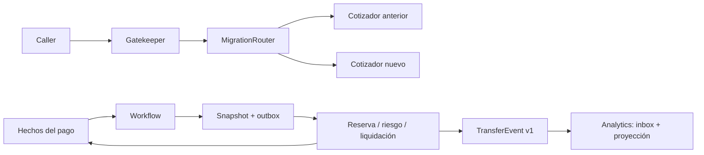

# Arquitectura y decisiones

## Contexto y límites

La plataforma ficticia cotiza comisiones, coordina un pago y genera una lectura analítica. `MigrationRouter` depende de un puerto de cotización; sus dos implementaciones pueden cambiar sin alterar al consumidor. `Workflow` recibe hechos y produce un snapshot y comandos. `Analytics` posee su inbox y su vista agregada. `Gatekeeper` recibe una identidad ya verificada. `Resilience` protege cada dependencia mediante políticas independientes.

El diagrama expresa responsabilidades. La API de saga aplica hechos, conserva snapshot/inbox/outbox en un checkpoint atómico y entrega los comandos a un participante local con recibos persistentes. Las flechas no implican un broker ni participantes bancarios externos. El núcleo y la proyección también tienen escenarios deterministas en memoria. [Persistencia y recuperación por reinicio](durable-sagas.md).

## Modularidad, acoplamiento y quantum

`ModuleAnalysis` recibe un inventario explícito; no escanea assemblies ni bytecode. Para cada módulo calcula Ca (módulos que dependen estáticamente de él), Ce (módulos de los que depende), A (clases abstractas / clases), I = Ce / (Ca + Ce) y D = |A + I − 1|. Por convenio, I es cero cuando no hay relaciones estáticas. Se cuentan vecinos únicos, para que duplicar una arista no distorsione el resultado.

La agrupación operacional une dependencias estáticas, llamadas síncronas obligatorias, despliegues comunes y almacenamiento compartido. Los enlaces asíncronos no unen grupos automáticamente. Es una heurística conservadora: no mide cohesión funcional, disponibilidad del broker, contratos temporales ni la criticidad de una llamada. Evaluar un quantum de arquitectura requiere también esas evidencias; el número de grupos no debe presentarse como una medición definitiva del quantum.

Separar `ledger` y `risk` en dos procesos aporta poco aislamiento si cada pago espera obligatoriamente a ambos. Publicar hechos para analítica permite que su consumidor se retrase sin bloquear una cotización. Extraer un contexto tiene sentido cuando su demanda, propietario o ritmo de cambio justifican el coste de comunicación y operación.

## Datos, soberanía y acceso

Cada participante debe poseer su almacenamiento. Reserva y liquidación de fondos necesitan invariantes fuertes dentro del ledger. Una saga coordina sus operaciones locales con otros participantes; compensar una reserva no equivale a borrar una liquidación confirmada. La vista analítica acepta retraso y se reconstruye con hechos publicados.

Este proyecto agrega **volumen transferido**, no saldo disponible ni estado de liquidación. Un fallo de analítica nunca debe autorizar o rechazar un pago. La deduplicación usa tanto EventId como TransferId: reenviar la misma transferencia con un nuevo identificador de evento tampoco aumenta el volumen.

| Acceso entre contextos | Coste y decisión en este caso |
| --- | --- |
| Consultar al propietario por API | Lectura actual, con latencia y dependencia de disponibilidad; usar en validaciones que la requieran |
| Replicar columnas por eventos | Datos locales con retraso; publicar sólo atributos necesarios y su versión |
| Caché replicada | Reduce lecturas; exige TTL, invalidación y tratamiento explícito de datos viejos |
| Compartir dominio o esquema | Simplifica joins; acopla cambios y permisos; sólo dentro de un límite de propiedad acordado |

No hace falta asignar una tecnología diferente a cada contexto. Para este caso, un almacenamiento relacional permite guardar snapshot y comandos en una transacción local. Una vista por moneda podría almacenarse en un sistema clave-valor si existen operaciones atómicas apropiadas.

| Modelo de almacenamiento | Pregunta que guía su evaluación |
| --- | --- |
| Relacional | ¿Necesitamos transacciones, restricciones y consultas por varias relaciones? |
| Documental | ¿La unidad de lectura y escritura es un documento con estructura variable? |
| Clave-valor | ¿Podemos resolver el acceso por una clave conocida? |
| Columnar / analítico | ¿Predominan agregaciones de muchas filas sobre pocas columnas? |
| Grafos | ¿El coste principal está en recorrer relaciones? |
| Series temporales | ¿Dominan ingestión, ventanas temporales y retención? |
| SQL distribuido / NewSQL | ¿La escala justifica transacciones distribuidas y su latencia? |
| Servicio cloud gestionado | ¿Sus límites, coste y recuperación encajan con el contexto? |

La etiqueta de una base no prueba sus garantías: hay que examinar su modelo de transacción, replicación y recuperación. Durante una partición, el diseño debe decidir qué operaciones rechazar y cuáles pueden continuar con información parcial; el ledger no debe dar por confirmada una transferencia cuyo resultado sea incierto.

## Orquestación y coreografía

El orquestador mantiene una máquina de estados explícita. Tras `Start`, solicita reserva; tras `Reserved`, evalúa riesgo; tras `Approved`, solicita liquidación. Una denegación o un fallo de liquidación lleva a `Compensating`. Sólo `Released` confirma `Compensated`. La ausencia de ese hecho conserva la compensación pendiente.

Cada comando tiene una identidad estable `sagaId:acción`. El receptor debe deduplicarla dentro de su propia transacción. Una repetición idéntica de un evento no produce comandos; reutilizar su identidad con contenido distinto produce conflicto. Un evento fuera de orden se rechaza sin modificar el snapshot, para que el adaptador pueda reintentarlo o investigarlo.

La alternativa `Choreography.React` muestra qué participante reacciona a cada hecho con las mismas claves. Carece de un registro global propio: su adaptador debe aportar inbox local, causalidad y reconciliación. Los escenarios comparan los efectos de ambos enfoques. La saga combina transacciones locales y compensaciones; no proporciona aislamiento global. [Referencia: patrón Saga, Microsoft](https://learn.microsoft.com/en-us/azure/architecture/patterns/saga).

Para persistencia real, confirmar **snapshot + registro del evento + outbox de comandos** en una sola transacción. Publicar desde el outbox y aceptar posibles duplicados. El consumidor confirma su offset después de guardar su inbox y su efecto. Una caída entre envío y confirmación puede repetir el mensaje; las claves estables permiten resolverla. Un timeout de liquidación requiere consultar el resultado por clave antes de asumir que hay que compensar.

## Migración y contratos

El puerto de cotización permite sustituir una implementación progresivamente, siguiendo Branch by Abstraction. El router hace selección gradual para ese caso de uso y permite rollback mediante una configuración del porcentaje. La separación completa de una función legacy sería la siguiente fase de Strangler Fig. [Branch by Abstraction, Martin Fowler](https://martinfowler.com/bliki/BranchByAbstraction.html), [Strangler Fig, Martin Fowler](https://martinfowler.com/bliki/StranglerFigApplication.html).

La selección usa SHA-256 del UUID canónico en minúsculas, interpreta los primeros cuatro bytes como entero sin signo en orden de red y calcula módulo 10.000. El mismo cliente conserva su ruta mientras el porcentaje no cambia. Un aumento incluye los buckets previamente seleccionados. El porcentaje expresa distribución estadística, no una cantidad exacta para una muestra pequeña.

`Compare` llama a los dos cotizadores, que son puertos de lectura. Si cambian las comisiones intencionalmente, una diferencia puede ser esperada: el operador debe definir sus criterios de aceptación. Una transferencia con efectos nunca debe ejecutar ambos backends para comparar.

Para migrar mediante reverse proxy, dirigir sólo el endpoint migrado a las dos implementaciones, mantener rutas estables, propagar correlation ID y comprobar salud antes de aumentar el porcentaje. La configuración de red, TLS y la autenticación permanecen en el adaptador. El router demuestra la política de decisión. Los adaptadores HTTP exponen el mismo contrato de cotización; el reverse proxy permanece como extensión de red.

Expand & Contract mantiene campos o rutas antiguos durante la transición. `examples/expand-contract.sql` añade `fee_minor_v2`, permite lectores antiguos y propone backfill y validación después de retirar los escritores anteriores. No elimina datos automáticamente. PostgreSQL permite añadir un CHECK con `NOT VALID` y validar después las filas existentes; las escrituras nuevas ya quedan sujetas al CHECK. [PostgreSQL: ALTER TABLE](https://www.postgresql.org/docs/17/sql-altertable.html).

El contrato público se encuentra en `contracts/transfer-completed.v1.schema.json`. Los DTO permiten desacoplarlo del almacenamiento interno. `schemaVersion` identifica la forma aceptada; las pruebas rechazan versiones desconocidas. Un campo opcional puede añadirse conservando v1; un cambio semántico requiere una nueva versión y consumidores capaces de coexistir. Los tests llaman al DTO tipado; el adaptador JSON debe validar el schema y deserializar enteros de 64 bits sin pasar por un `double`.

Event interception se estudia mediante una frontera de integración: capturar hechos confirmados del sistema anterior y actualizar una proyección del nuevo, preservando identidad y versión. No capturar intentos antes del commit ni formar ciclos de eventos entre ambos sistemas. El método `Analytics.Apply` es el receptor; el transporte o CDC no está implementado.

## Resiliencia, disponibilidad y seguridad

Los reintentos sólo capturan `TransientFailure`, con cantidad máxima y backoff exponencial. Los errores de negocio no se reintentan. El reloj y la espera son inyectables; las pruebas usan tiempo virtual. En un adaptador de red, aplicar timeout, cancelación, jitter y un presupuesto total; todas las capas deben compartir un límite para evitar multiplicar reintentos.

El circuit breaker abre después de fallos transitorios consecutivos y permite una prueba al vencer el cooldown. El bulkhead limita las operaciones admitidas y libera capacidad incluso tras una excepción. El breaker serializa sus llamadas para hacer visible y verificable la prueba única; una implementación de alto rendimiento debe ejecutar las llamadas fuera del bloqueo y controlar la admisión de probes. [Circuit Breaker, Microsoft](https://learn.microsoft.com/en-us/azure/architecture/patterns/circuit-breaker), [Bulkhead, Microsoft](https://learn.microsoft.com/en-us/azure/architecture/patterns/bulkhead).

Un fallback puede devolver una cotización con indicación de antigüedad; no debe inventar confirmaciones de pago. Deployment stamps aíslan conjuntos de clientes y recursos; las zonas o regiones requieren también un diseño de replicación y failover. El balanceo por colas regula la admisión, pero los workers necesitan límites y alertas por antigüedad. Estas son extensiones de despliegue, no componentes cloud implementados aquí.

El gatekeeper verifica sujeto propietario y scope antes de consumir cuota. Su limitador por ventana vive en un solo proceso; varios réplicas requerirían coordinar las cuotas. Tiene capacidad acotada de 10.000 principals activos. Una API real necesita un adaptador que verifique firma, emisor, audiencia y expiración de tokens; una API key identifica una aplicación y no sustituye automáticamente la identidad del usuario.

## Operación, analítica y rendimiento

Los logs estructurados incluyen timestamp UTC, correlation ID, servicio, operación y resultado. No registrar tokens ni datos personales como campos adicionales. Los contadores separan requests, errores y duración total; la alerta usa un mínimo de observaciones y supera estrictamente la fracción de errores configurada. Una evaluación real necesita ventanas móviles y percentiles, además de tasa de éxito, latencia, saturación y edad de la cola.

El consumidor analítico podría alimentar un warehouse para reporting, un lake para hechos sin transformar o un producto de datos con propietario y contrato. Esa elección no cambia la obligación de mantener trazabilidad y evitar duplicados. El proyecto conserva únicamente un agregado por moneda en memoria.

Los snapshots, eventos y comandos representan valores; el snapshot copia su colección de eventos al construirse. Un almacenamiento por contenido necesitaría canonicalización, hash y verificación al leer; ese adaptador es un extensión pendiente. La idempotencia está implementada en la saga y en el consumidor analítico.

Crear clientes HTTP o pools de base de datos por solicitud aumenta costes y conexiones. Compartir una única capacidad entre tenants permite que un vecino ruidoso perjudique a otros; separar bulkheads por dependencia o tenant acota el efecto. Replicar una pequeña regla de valor puede ser más barato que introducir una biblioteca compartida con releases coordinados. Los contratos compartidos requieren versionado y pruebas de consumidores; un sidecar añade otro proceso y debe justificar su coste.
