# Entrega y operación

## Flujo de entrega

```mermaid
flowchart LR
    PR[Pull request] --> Verify[Windows + Linux: aceptación y paridad]
    Verify --> Build[Build por digest]
    Build --> HTTP[Pruebas en contenedores y HTTP]
    HTTP --> Scan[Secret scanning y vulnerabilidades]
    Scan --> SBOM[SBOM SPDX]
    SBOM --> Publish[GHCR + bundle por commit]
    Publish --> Attest[Procedencia firmada por GitHub]
    Attest --> Controller[Controlador privado]
    Controller --> VerifyRelease[Checksum, firma, commit e identidad]
    VerifyRelease --> Laptop[Docker Desktop: laptop]
    Laptop --> Health[Readiness y smoke]
    Health --> Current[Registrar entrega / restaurar anterior]
```

## CI público

El workflow `.github/workflows/ci.yml` ejecuta aceptación en dos sistemas operativos y compara contratos entre lenguajes. El job de contenedores construye para Linux amd64, verifica los escenarios empaquetados y comprueba los contratos HTTP. Trivy examina secretos y vulnerabilidades; también produce dos SBOMs SPDX.

Los actions y las imágenes base se fijan por SHA o digest. Dependabot propone actualizaciones; su aceptación vuelve a ejecutar los controles. La publicación ocurre únicamente en pushes de `main`. Los PRs carecen de acceso al runner privado.

El scanner bloquea vulnerabilidades HIGH/CRITICAL con corrección disponible. El informe conserva también información sobre componentes; aceptar ausencia de corrección no equivale a ausencia de riesgo. El pipeline no usa excepciones particulares para permitir publicar un hallazgo conocido.

## Bundle de entrega

Las imágenes se publican como `ghcr.io/jorgefprietol/payment-architecture-platform-csharp:<commit>` y `...-java:<commit>`. El mismo contenido se exporta como `images.tar.gz`; `release.json` vincula repositorio, commit, ejecución, checksum y digest de configuración de cada imagen. El bundle recibe una [atestación de procedencia de GitHub](https://docs.github.com/en/actions/concepts/security/artifact-attestations).

El digest de configuración se obtiene del archivo exportado, en lugar del campo `Id` dependiente del backend de Docker. Después de cargar las imágenes se comprueban la configuración firmada, las capas, la plataforma y la revisión de origen. Ese contrato funciona con el almacén clásico de Docker y con containerd en Docker Desktop.

El despliegue verifica esa atestación contra el workflow CI, `refs/heads/main` y el commit seleccionado. Rechaza procedencia producida por runners propios. La exportación permite promover el contenido ya probado aunque las políticas de acceso de GHCR cambien; el despliegue usa el artefacto firmado de GitHub Actions.

## Controlador privado y laptop

El repositorio `jorgefprietol/payment-architecture-platform-deploy` contiene únicamente el workflow de control. Puede ejecutarse manualmente y reconcilia entregas mediante una programación de cinco minutos. GitHub puede retrasar ejecuciones programadas; no se ofrece un SLA de cinco minutos.

El controlador descubre la última ejecución exitosa del CI de `main` y el runner privado vuelve a validar sus datos y que el commit siga siendo la cabeza actual. Repetir una entrega ya instalada termina sin cambios. La laptop utiliza su autenticación existente de GitHub CLI para descargar y verificar artefactos; no hay un token personal guardado en los repositorios.

La instalación local utiliza un directorio independiente para credenciales, entregas y estado de operación. El workflow define `PAYMENT_DEPLOY_ROOT`; los archivos `current.json` y `.env` no se publican. Un bloqueo de archivo y una concurrency group evitan despliegues simultáneos. Las imágenes se cargan y se comprueba su identidad antes de modificar servicios.

Los servicios se publican en loopback, C# en 18080 y Java en 18081. Se ejecutan readiness y smoke tests antes de actualizar `current.json`. Un fallo de readiness o smoke restaura las referencias, configuración y pruebas de la entrega previa. En la primera instalación, un fallo elimina sólo los servicios del proyecto `payment-platform`. Se conservan imágenes y directorios anteriores para recuperación.

## Recuperación y mantenimiento

El runner debe estar conectado, Docker Desktop disponible y la sesión Windows iniciada. Su arranque se configura para la sesión de este usuario; operar antes del login exigiría instalar un servicio con los permisos correspondientes. El estado online del runner puede consultarse en Settings → Actions → Runners del repositorio privado.

Para detener servicios, utilizar el compose de la entrega activa y el archivo de variables local. Para desactivar entregas automáticas, deshabilitar el workflow de despliegue en el repositorio privado. Los cambios de plataforma pasan por PR, validación y publicación; una nueva entrega nunca recompila en la laptop.

La separación de los runners públicos y privados sigue el modelo de [runners de GitHub](https://docs.github.com/en/actions/how-tos/manage-runners/self-hosted-runners/add-runners). El controlador sólo ejecuta código de la rama publicada con CI exitoso; administrar el repositorio privado y su runner sigue siendo responsabilidad del propietario.
